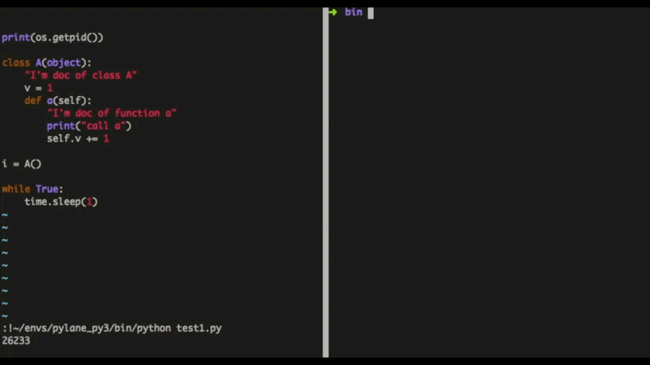

# pylane

[](https://badge.fury.io/py/pylane)


[简体中文](README.zh-cn.md)

Pylane is a python vm injector with debug tools, based on gdb and ptrace.
Pylane uses gdb to trace python process, inject and run some code in its python vm.

## Usage



use inject command to inject a python script in an process:

```
pylane inject <PID> <YOUR_PYTHON_FILE>
```

use shell command to inject an interactive shell:

```
pylane shell <PID>
```

Pylane shell features:

* use IPython as its interactive interface, support magic functions like ? and %
* support remote automatic completion
* provide debug toolkit functions, such as:
  * lookup class or instance by name
  * get source code of an object
  * print all threads' stack and locals

## Install

```
pip install pylane
```

pylane should be installed in virtualenv the target process uses or in os python lib.

## Compatibility

Support Linux and BSD
